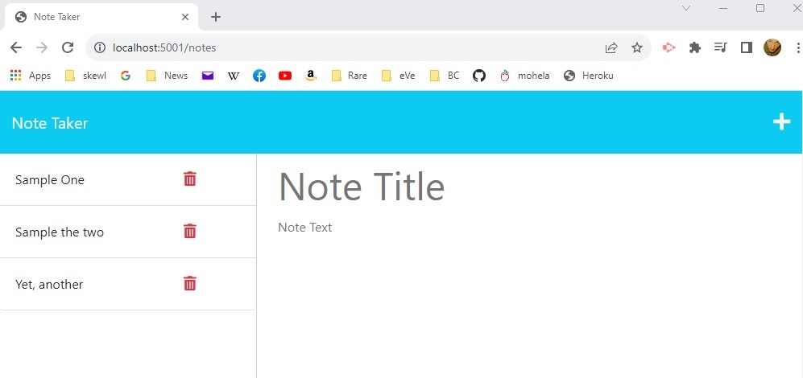

# 11-Take-Them-Notes
## Description
Simple no-frills note taking web app.  Polished front-end, Express serving the back-end, all hosted on Heroku.

### By: Caine Winters

## Usage
- Navigate to landing page.
- Click on **GET STARTED** button.
- Enter title and text, then **SAVE** button to save title to cards on left.
- Click on card title to repopulate right column with that selection's title and notes.
- Click on the **TRASH** button within left column's cards to delete the indicated note.
- If current title/note field is not blank, click the **+** button in upper-right corner to empty those fields for a new note to be entered. 

### Screenshots of logos 

## Links
### [Link to repo](https://github.com/elcaine/11-Take-Them-Notes)
### [Link to video NEED TO CHANGE](https://www.youtube.com/watch?v=EBqvwCcB5wg)

### Acknowledged sources
- Express logic based on Activity 28 from this module.